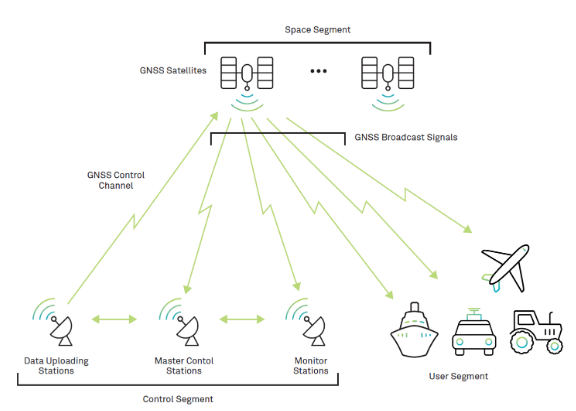

# Part 1: Global Navigation Satellite System (GNSS)

GNSS is a global network of satellites, whose orbits and timing are broadcast by satellite for the purposes of navigation and positioning.

## Overview
Thousands of satellites orbit Earth, serving purposes like communication, navigation, Earth observation, and scientific research for governments, militaries, and civilians. Each satellite is placed in a specific orbit tailored to its function. The most commonly used orbits are *Low Earth Orbit (LEO)*, *Medium Earth Orbit (MEO)*, and *Geostationary Earth Orbit (GEO)*. **_GNSS constellations are in Medium Earth Orbit (MEO)_**.

<!-- Crop table image below -->
 
*Source: K. Sergieieva (2024),[Types Of Satellites: Different Orbits & Real-World Uses](https://eos.com/blog/types-of-satellites/), EOS Data Analytics* 

| Orbit Type | Region of Space | Primary Pourpose |
|:----------:|:---------------:|:----------------:|
|LEO (Low Earth Orbit)|No grater than 2000 km |remote sensing, high-resolution earth observation, and scientific research |
|MEO (Midium Earth Orbit)|2000 km to 35,586 km |Positioning and navigation services |
|GEO (Geostationaly Earth Orbit)|35,586 km to 35,986 km (GEO +/- 200 km) | Telecommunications and Earth observation | 
||||

*Sources: Region of Space [[1]](https://ntrs.nasa.gov/api/citations/20100007939/downloads/20100007939.pdf), Primary Purpose [[2]](https://eos.com/blog/types-of-satellites/)*

 

---
*[1] N. L. Johnson, (2010), [Medium Earth Orbits: Is There a Need for a Third Protected Region?](https://ntrs.nasa.gov/api/citations/20100007939/downloads/20100007939.pdf), 61st International Astronautical Congress, No. JSC-CN-21489* 
*[2] K. Sergieieva (2024),[Types Of Satellites: Different Orbits & Real-World Uses](https://eos.com/blog/types-of-satellites/), EOS Data Analytics* 

ℹ️ *More detail about topic:* 
*[Online Index of Objects Launched into Outer Space
](https://www.unoosa.org/oosa/osoindex/search-ng.jspx#?c=%7B%22filters%22:%5B%5D,%22sortings%22:%5B%7B%22fieldName%22:%22object.launch.dateOfLaunch_s1%22,%22dir%22:%22desc%22%7D%5D%7D), United Nations Office for Outer Space Affairs - Web* 
*[Types of Orbits](https://www.spacefoundation.org/space_brief/types-of-orbits/), Space Foundation - Web* 
*[SpaceXplore](https://geoxc-apps.bd.esri.com/space/satellite-explorer/), ESRI - Web* 

## GNSS Constellations
A satellite constellation is a network of similar artificial units with shared control, communicating with global ground stations and designed to work together as a system.

* [GPS (USA)](https://www.faa.gov/about/office_org/headquarters_offices/ato/service_units/techops/navservices/gnss/gps), 
* [GLONASS (Russia)](https://glonass-iac.ru/en/about_glonass/), 
* [Galileo (European Union)](https://www.euspa.europa.eu/eu-space-programme/galileo), 
* [BeiDou (China)](http://en.beidou.gov.cn/), and 
* others ([IRNSS/NavIC (India)](https://www.ursc.gov.in/navigation/irnss.jsp),
[QZSS (Japan)](https://qzss.go.jp/en/overview/services/sv02_why.html)).

 
*Source: [What are the limitations of GNSS?](https://inertiallabs.com/what-are-the-limitations-of-gnss/), Inertial Labs, 2024*

**Updates:** 
The number of satellites and their operational status changes over time. This information pertains to April 2023.
>* GPS - 31 satellites (31 operational)
>* GLONASS - 25 satellites (24 operational)
>* Galileo - 28 satellites (24 operational)
>* BeiDou - 29 satellites (27 operational) 
*Source: [GPS Overview Part 1: What is GPS and GNSS Positioning?](https://eos-gnss.com/knowledge-base/gps-overview-1-what-is-gps-and-gnss-positioning), EOS Positioning System*
 
 

## GNSS Architechture
GNSS systems are composed of three segments, **_space segment_**, **_control segment_** and **_user segment_**. 

 
*Source [What are Global Navigation Satellite Systems?](https://novatel.com/tech-talk/an-introduction-to-gnss/what-are-global-navigation-satellite-systems-gnss), NovAtel*

1. **Space segment**: 
Series of satellites continuously transmit signals.
2. **Control segment**:
The orbit, attitude, location, speed, and clock drift of satellites can change due to perturbations. Control segment ensures the accuracy of satellites' clocks and orbits. It consists of ground-based monitor stations, master control stations, and upload stations.

    * **Monitor stations** - Track the satellite continuously and send tracking information to the master control station. 
    * **Master control stations** - Process recieved infomation to correct satellite orbit and clock errors and forward it to the upload station.
    * **Upload station** - Transmit the correction to each satellite at lease once every day.
3. **User segment**: 
    - **Signal reception:** A GNSS receiver picks up signals from multiple satellites. 
    - **Ranging code decoding:** The receiver measures the time it takes to receive the ranging code from each satellite, which is used to calculate the distance to the satellite. 
    - **Trilateration:** By using the distances to multiple satellites, the receiver can calculate its own 3D position on Earth. 
 
 

## GNSS Signal

### GNSS Frequencies and Signals
GNSS uses radio waves to transmit signals from satellites to receivers on Earth. Let's look at the [GNSS Frequencies and Signals](https://novatel.com/support/known-solutions/gnss-frequencies-and-signals). There are multiple GNSS constellations that use the same frequency, but their signals differ. When a GNSS receiver that can receive 1575.42MHz, what signals can be obtained in the United States? 

* GPS (L1 C/A, L1C)
* Galileo (E1)
* BeiDou (B1C)
* SBAS (L1)

In order to determine its own position, GNSS receivers must be able to gather all the necessary information from satellite signals.

### Key components of a GNSS signal:
**Carrier wave and modulation:**
Carrier waves have a constant frequency and do not carry information by themselves. To transmit information over a distance, these waves must be modified with information, a process known as modulation. GNSS satellites use a specific type of modulation called phase modulation (PM).

 
*Source: [3.4 GNSS Signals](https://usq.pressbooks.pub/gpsandgnss/chapter/3-4-gnss-signals/), University of Southern Queensland, [Global Navigation Satellite System (GNSS)](https://www.princeton.edu/~alaink/Orf467F07/GNSS.pdf), Princeton University*

**Ranging code:**
The ranging code is a sequence of binary digits (0s and 1s) that enables GNSS receivers to calculate the distance to a satellite by measuring the travel time of radio signal from the satellite to the receiver.

**pseudo-random noise (PRN) ranging codes**
Pseudo-Random Noise (PRN) code is a type of ranging code used in satellite navigation systems. It appears random, providing security by obscuring data, but its deterministic algorithm allows decryption with an encryption key when it is encrypted. Most GNSS data transmitted for civilian use is not encrypted which poses security concerns (e.g., spoofing and jamming). Some commercial industries, navigation services, and military operation use encryption. 

**Navigation message:**
Navigation messages are modulated in PRN code and a data stream contains information about the satellite's position, clock status, health, and other relevant data. 

- **Satellite ID:** Identifies the transmitting satellite
- **GPS time:** Precise time information from the satellite
- **Ephemeris data:** Detailed orbital information about the satellite's position
- **Almanac data:** Less precise orbital information about all 
satellites in the constellation
- **Satellite health status:** Indicates if the satellite is functioning properly 

 
*Source: [How satellite signals are received and processed - Intro to GNSS Episode 3, Hexagon | NovAtel](https://www.youtube-nocookie.com/embed/KnigBL_-L4g?playlist=KnigBL_-L4g&autoplay=1&iv_load_policy=3&loop=1&start=), Hexagon|NovAtel - YouTube (2:40)*

### Observables
Two types of observables, Pseudorange and Carrier wave. They are used to calculate distance between the satellite and the receiver.  

#### Pseudorange Observable

>The GNSS receiver generates the same code as the satellite to determine the signal delay time and calculate the distance to the satellite. This is called pseudorandom code correlation. Each GNSS satellite transmits a unique pseudorandom code repeated at short intervals (e.g., every millisecond for GPS). The receiver has copies of these codes for each satellite and synchronizes them with the signals coming from the satellites. When the receiver receives a signal from a satellite, it matches its own generated code to the received signal. 
>The correlation process (alignment) allows us to determine the time difference between the transmission of the code by the satellite and the reception of this signal by the device. This time difference, multiplied by the speed of light, gives the distance to the satellite. Knowing the exact time when the satellite sends the signal and calculating the delay based on the correlation of the codes, the receiver determines its distance from the satellite.  
 
*Source: [Global Navigation Satellite System (GNSS) And Satellite Navigation Explained](https://inertiallabs.com/gnss-and-satellite-navigation-explained/), 11/07/2024, InertialLab*

 
*Source: [Global Navigation Satellite System (GNSS) And Satellite Navigation Explained](https://inertiallabs.com/gnss-and-satellite-navigation-explained/), 11/07/2024, InertialLab*

#### Carrier Phase Observable

*Source: [How satellite signals are received and processed - Intro to GNSS Episode 3, Hexagon | NovAtel](https://www.youtube-nocookie.com/embed/KnigBL_-L4g?playlist=KnigBL_-L4g&autoplay=1&iv_load_policy=3&loop=1&start=), Hexagon|NovAtel - YouTube (7:35)*
 
 
