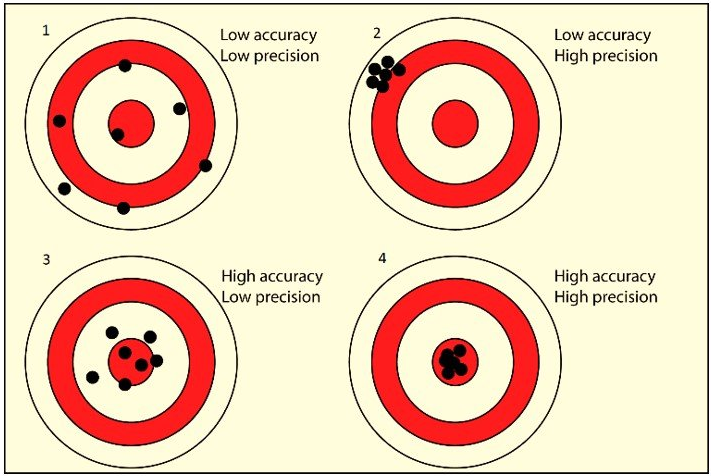
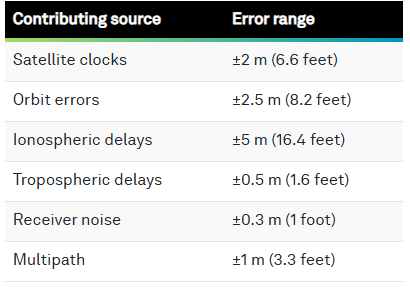
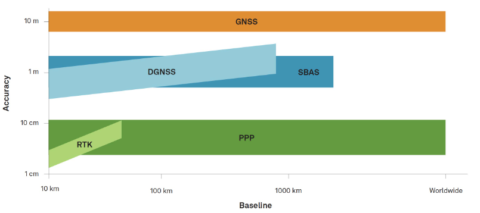

# Part 2: Global Navigation Satellite System (GNSS)

## How GNSS Works
* As GNSS require minimum of 4 satellites to calculate the position, 3 satellites for a location and 4th satellite for time synchronization. The more satellites the better the accuracy. *For more info ℹ️ a, b, c.*

* The satellites are in the orbit and the signals are transmitted to the GNSS receiver on the ground. *For more info ℹ️ d.*

* The receiver calculates the distance to each satellite based on the time it takes for the signal to reach the 
receiver.</br>
    >**Distance** = **Speed of light** (300,000km/s) x **Time** (taken for signal to travel from satellite to receiver)</br>
* The receiver then uses this information to determine its position on the Earth's surface. The accuracy of the position depends on the number of satellites, the geometry of the satellites, and the quality of the signals.

---
ℹ️ *More detail about topic:*<br>
[a] *[The Global Positioning System](https://oceanservice.noaa.gov/education/tutorial_geodesy/geo09_gps.html), NOAA - Web*<br>
[b] *[How GPS works? Trilateration explained
](https://www.youtube-nocookie.com/embed/4O3ZVHVFhes?playlist=4O3ZVHVFhes&autoplay=1&iv_load_policy=3&loop=1&start=), unfa🇺🇦 - YouTube*<br>
[c] *[Working of GPS | Why four satellites | How is time offset corrected](https://www.youtube-nocookie.com/embed/CMSCgAxDASc?playlist=CMSCgAxDASc&autoplay=1&iv_load_policy=3&loop=1&start=), Science for Common man - YouTube*<br>
[d] *[Understanding Satellite Frequencies and GNSS Receiver Channels](https://globalgpssystems.com/gnss/understanding-satellite-frequencies-and-gnss-receiver-channels/), Global GPS Systems - Web*

## Accuracy and Precision
The image below displays difference between accuracy and precision. 

<br>
*Source: [Global Navigation Satellite System (GNSS) And Satellite Navigation Explained](https://inertiallabs.com/gnss-and-satellite-navigation-explained/), InertialLabs, 2024*<br>

## GNSS Error Sources
Several factors can affect positioning accuracy, including satellite clocks, obituaries, atmospheric conditions, receiver noise, and multipaths.

<br>
*Source: [Chapter 4: GNSS error sources](https://novatel.com/an-introduction-to-gnss/gnss-error-sources), NovAtel*<br>
<br>
<br>


# GNSS Argumentations
Augmenting a GNSS correct errors and enhances its performance in terms of **_accuracy_**, **_reliability_**, and **_availability_** by incorporating external information into the user's position solution.

## Satellite Based Augmentation Systems (SBAS)
SBAS are GEO (Geostationary Earth Orbit) systems receive correction information from the control segment and transmit it to user segments. 


*Source: [Satellite Based Augmentation System (SBAS)](https://novatel.com/an-introduction-to-gnss/resolving-errors/sbas), NovAtel*

### Implemented SBAS services
* Wide Area Augmentation System (WAAS) (United States)
* European Geostationary Navigation Overlay Service (EGNOS) (European Space Agency)
* BeiDou Satellite-Based Augmentation System (BDSBAS) (China)
* MTSAT Satellite Based Augmentation System (MSAS) (Japan)
* GPS-Aided GEO Augmented Navigation (GAGAN) system (India)

<br>

---
ℹ️ *Ground Based Augmentation System (GBAS)*<br>
*GBAS was initially referred to as the Local Area Augmentation System (LAAS). Networks of GBAS use VHF or UHF frequencies and provide localized reception within tens of kilometres of receivers and it is primarily used in aviation purposes. For more information visit [Ground Based Augmentation System (GBAS)](https://www.faa.gov/airports/planning_capacity/non_federal/gbas), Federal Aviation Administration website*.
<br>
<br>

## Methods Used to Improve GNSS Accuracy
Generally GNSS accuracy is 2-10 meters depending on the number of satellites and the geometry of the satellites, 
but approximately 2 meters. However, there are methods to improve centimeter accuracy.
* Differential GNSS (DGNSS)
* Real-Time Kinetic (RTK) positioning
* Precise Point Positioning (PPP)
* PPP-RTK
* Post-Processed Kinematic (PPK) positioning

### Differential GNSS (DGNSS)
* Utilizes ```pseudorange``` measurements to calculate the difference between the measured distance and the known distance to the satellite.
* A single, standalone base station and a rover and communication link between them.

<br>
*Source: [Differential GNSS (DGNSS)](hhttps://novatel.com/an-introduction-to-gnss/resolving-errors/differential-gnss), NovAtel*<br>


### Real-Time Kinetic (RTK) positioning
* Utilizes ```carrier range``` mesurements to calculate the difference between the measured distance and the known distance to the satellite.
* Choice of ```local RTK``` or ```network RTK```.
  * **Local RTK**: a single, standalone base station and a rover and communication link between them.
  * **Network RTK**: Essentially the network RTK refers to the Networked Transport of RTCM via Internet Protocol (NTRIP) service. 
    * Free NTRIP services such as [NOAA CORS](https://geodesy.noaa.gov/UFCORS/) available in some states in the US.
    * NPS NTRIP - [https://www.gps.gov/cgsic/meetings/2021/smith.pdf](https://www.gps.gov/cgsic/meetings/2021/smith.pdf)
    * Subscription-based NTRIP services such as [Leica SmartLink](https://leica-geosystems.com/en-us/products/gnss-systems/smart-antennas/leica-viva-gs16/life-beyond-traditional-rtk-satellite-based-precise-point-positioning)
    
    \* _[List of RTK correction services and NTRIP Casters in United States](https://www.ardusimple.com/rtk-correction-services-and-ntrip-casters-in-the-united-states-of-america-usa/), ArduSimple_


*Source: [Real-Time Kinematic (RTK)](https://novatel.com/an-introduction-to-gnss/resolving-errors/rtk), NovAtel*<br>


#### Networked Transport of RTCM via Internet Protocol (NTRIP)

NTRIP is a protocol designed to stream GNSS correction data over the internet for Real Time Kinematic (RTK) positioning. It is built on the HTTP/1.1 protocol and optimized for integration with RTK correction services.<br>

Key components of NTRIP include:  

- Server: Streams GNSS data to the NTRIP Caster.
- Caster: Acts as a relay, distributing data from the NTRIP Server to multiple NTRIP Clients.
- Client: Receives GNSS data from the NTRIP Caster for use in real-time applications.
- NTRIP uses standard internet protocols (HTTP/HTTPS) and is designed to be lightweight and efficient, making it suitable for use over various types of internet connections.

**Q: What is RTCM?**<br>
Radio Technical Commission for Maritime Services (RTCM) is a non-profit international standards organization. RTCM has released internationally recognized standards for 

- maritime navigation, 
- communication equipment, 
- distress alert systems, and 
- satellite positioning technologies like GPS. 

These standards support various fields, including 

- transportation, 
- surveying, geodesy, 
- precision agriculture, and 
- autonomous vehicles, 


# Precise Point Positioning (PPP)
* Uses a global network of GNSS stations for precise 
satellite orbits and clock corrections and broadcast directory 
from satellites to GNSS receivers achieving centimeter-level 
accuracy. 
* Ideal for high-precision positioning in remote or 
challenging environments where RTK corrections are unavailable. 
* PPP can also be used with RTK to enhance accuracy and provide 
redundancy in critical applications (PPP-RTK)

# Precise Point Positioning (PPP) Services with EOS Arrow
* Galileo High Accuracy Service (HAS)
  * Initial Service on the 24th of January 2023
  * Global coverage (Service Level 1 (SL1)) -  typical convergence time of less than 300 seconds (5 minutes)
  * Regional coverage availability over the European Coverage Area (ECA) (Service Level 2 (SL2)) - convergence time will be lower than 100 seconds
  * Free of charge
  * Real-time corrections
  * Accuracy target (95%): 20cm (horizontal) / 40cm (vertical)
  * E6-B signal
  * Internet not required
  [EOS Positioning](https://eos-gnss.com/blog/galileo-high-accuracy-service-early-observations)
  Note: [Galileo HAS Internet Data Distribution](https://www.gsc-europa.eu/galileo/services/galileo-high-accuracy-service-has/internet-data-distribution) service also available.
  [FAQs on HAS](https://www.gsc-europa.eu/galileo/faq#HAS)  

[Have you met HAS? 22 Jan 2024](https://www.euspa.europa.eu/newsroom-events/news/have-you-met-has#:~:text=While%20SL1%20will%20have%20a,be%20lower%20than%20100%20seconds.)
[PPP Galileo HAS Technology: Pros and Cons](https://gpsgeometer.com/en/blog/pros-and-cons-of-ppp-galileo-has)

# Precise Point Positioning (PPP) Services with Leica SmartLink
* Subscription-based
* Correction based argumentation satellites
[SmartLink](https://leica-geosystems.com/en-us/products/gnss-systems/smart-antennas/leica-viva-gs16/life-beyond-traditional-rtk-satellite-based-precise-point-positioning)

# Post-Processed Kinematic (PPK) positioning
* Involves processing the raw GNSS data after the data collection.

<br>

## Comparison Table 
<table>
    <thead>
        <tr>
            <th style="text-align: center">Method</th>
            <th>Accuracy</th>
            <th>Pros</th>
            <th>Cons</th>
        </tr>
    </thead>
    <tbody>
        <tr>
            <td style="text-align: center">DGNSS</td>
            <td>1-3 meters</td>
            <td>
                <ul>
                    <li>Relatively simple to implement.</li>
                    <li>Available in many regions (especially near coastal areas, due to the availability of reference stations).</li>
                    <li>Provides real-time corrections, improving accuracy over basic GNSS.</li>
                </ul>
            </td>
            <td>
                <ul>
                    <li>Limited accuracy compared to more advanced techniques like RTK or PPP.</li>
                    <li>Requires local reference stations, which might not be available in remote areas.</li>
                    <li>Can be affected by signal interference or multipath errors.</li>
                </ul>
            </td>
        </tr>
        <tr>
            <td style="text-align: center">RTK</td>
            <td>1-3 cm (centimeter level)</td>
            <td>
                <ul>
                    <li>High accuracy, providing centimeter-level precision in real-time.</li>
                    <li>Great for applications that need precise positioning (e.g., surveying, construction, autonomous vehicles).</li>
                    <li>Real-time corrections reduce the need for post-processing.</li>
                </ul>
            </td>
            <td>
                <ul>
                    <li>Requires a nearby base station, which might not be available in remote areas.</li>
                    <li>Susceptible to signal obstructions (e.g., buildings, trees) and atmospheric conditions.</li>
                </ul>
            </td>
        </tr>
        <tr>
            <td style="text-align: center">PPP</td>
            <td>Sub-centimeter to centimeter-level</td>
            <td>
                <ul>
                    <li>No need for a local reference station, so it can be used anywhere in the world.</li>
                    <li>Highly accurate after post-processing.</li>
                    <li>Suitable for remote areas and areas where RTK may not be feasible.</li>
                </ul>
            </td>
            <td>
                <ul>
                    <li>Post-processing is required for high-precision results, which means it's not a real-time solution.</li>
                    <li>Processing can be time-consuming.</li>
                    <li>Real-time PPP is still evolving and not as accurate as RTK in real-time.</li>
                </ul>
            </td>
        </tr>
        <tr>
            <td style="text-align: center">PPK</td>
            <td>1-3 cm (centimeter level)</td>
            <td>
                <ul>
                    <li>High accuracy, suitable for remote areas, no need for real-time link</li>
                    <li>Great for applications where real-time corrections are not essential (e.g., aerial surveys, geodesy).</li>
                    <li>Useful when communication links are unreliable or unavailable during data collection.</li>
                </ul>
            </td>
            <td>
                <ul>
                    <li>Requires post-processing, so it's not suitable for real-time applications.</li>
                    <li>Data must be collected and stored during the operation, which requires more storage space and processing time afterward.</li>
                    <li>Slightly more complex than traditional GNSS methods.</li>
                </ul>
            </td>
        </tr>
    </tbody>
</table>

*Source: Information in the table was generated by [ChatGPT (Feb 3 version)](https://openai.com/chatgpt), OpenAI, 2025*



*Source: [Which correction method?](https://novatel.com/an-introduction-to-gnss/resolving-errors/which-correction-method), NovAtel*


