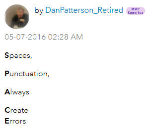

# AGOL and Portal and ArcGIS Pro Overview

## ArcGIS Online
_The NPS is consolidating its web GIS platform to ArcGIS Portal._

## ArcGIS Portal
ArcGIS Portal (Portal for ArcGIS) is an on-premises web GIS platform that allows organizations to manage and share GIS resources within their own infrastructure. It provides similar capabilities to ArcGIS Online but is hosted on the organization's servers. Key features include:

* Secure Environment: Host GIS data and services within the organization's network.
* Customizable: Tailor the portal to meet specific organizational needs.
* Integration: Integrate with other enterprise systems and ArcGIS products.
* Collaboration: Share maps, apps, and data securely within the organization.

### Roles and privileges
What organization members can do on ArcGIS Portal depends on your roles and privileges. Roles and privileges are used to control access to resources and capabilities within the portal. Organizations can maintain control over sensitive data and resources by assigning appropriate roles and privileges to users, so they have the necessary access to perform their tasks. For more information, see the link below. 
https://enterprise.arcgis.com/en/portal/10.5/use/roles.htm

## ArcGIS Pro
ArcGIS Pro is a desktop GIS application that provides advanced tools for spatial analysis, data management, and map creation. It is part of the ArcGIS suite and integrates with both ArcGIS Online and ArcGIS Portal. Key features include:
* 3D Visualization: Create and analyze 3D data and scenes.
* Advanced Analysis: Perform complex spatial analysis and geoprocessing tasks.
* Data Management: Manage and edit spatial data in various formats.
* Integration: Seamlessly integrate with ArcGIS Online and ArcGIS Portal for data sharing and collaboration.
* These three components work together to provide a comprehensive GIS solution, allowing users to leverage the power of cloud-based, on-premises, and desktop GIS tools.

## ArcGIS Field Maps and Survey123

### ArcGIS Field Maps vs Survey 123 vs Collector

ArcGIS Field Maps and Survey123 and Collector applications are used for field data collection. ArcGIS Collector and ArcGIS Field Maps are more map-centric and suitable for spatial data collection, whereas ArcGIS Survey123 is form-centric and ideal for structured surveys and inspections. ArcGIS Field Maps is a more integrated solution that combines the functionalities of multiple apps, including ArcGIS Collector. In this training, we cover Field Maps and Survey123

## Geodatabase (.gdb)

A geodatabase is integral to Esri's ArcGIS platform, serving as a central hub for spatial data management. It accommodates diverse data types like vector, raster, and tabular data while offering sophisticated management features. These capabilities include versioning, topology, the ability to create network datasets and more.

It is *highly recommended* to use file geodatabases and feature classes (individual GIS data layers stored within a file geodatabase) vs. shapefiles for many data management purposes. Click [here](https://www.esri.com/news/arcuser/0309/files/9reasons.pdf)for further documentation on file geodatabases. For additional data management best practices, please see the data management webinar [here](https://imrgis.nps.gov/storage/app/media/Webinars/IMR-GIS-Webinar-GIS-Data-Management-20190612-1706-1.mp4)[[MS2\]](#_msocom_2) from June 2019.

### Types  of  geodatabases

There are different types of geodatabases:

> - [File geodatabases](https://pro.arcgis.com/en/pro-app/3.4/help/data/geodatabases/manage-file-gdb/file-geodatabases.htm)—A file geodatabase is stored as multiple files in a folder with a .gdb extension. Each dataset is contained in a single file. By default, files can grow to 1 TB, but this can be changed to 4 or 256 TB using a configuration keyword.
>
> - [Mobile geodatabases](https://pro.arcgis.com/en/pro-app/3.4/help/data/geodatabases/manage-mobile-gdb/mobile-geodatabases.htm)—A mobile geodatabase is stored in an SQLite database that is entirely contained in a single file and has a .geodatabase extension.
>
> - [Enterprise geodatabases](https://pro.arcgis.com/en/pro-app/3.4/help/data/geodatabases/introduction/geodatabase-administration.htm#GUID-25CDE859-C0DC-40E6-B15B-B0B0EECD4D6B)—Also known as multiuser geodatabases, enterprise geodatabases are stored in relational databases. They can be virtually unlimited in size and number of users; the limits differ depending on the database management system (DBMS) vendor.
>
>   [types-of-geodatabases](https://pro.arcgis.com/en/pro-app/latest/help/data/geodatabases/overview/types-of-geodatabases.htm)

### More about geodatabase
https://pro.arcgis.com/en/pro-app/latest/help/data/geodatabases/overview/what-is-a-geodatabase-.htm

#### Personal geodatabase is long gone...
- The Personal geodatabase could not take advantage of 64-bit hardware because it was based on old technology. For more information, see the link below.

  [It's Not Personal: A brief history of the geodatabase and why personal geodatabases are not in ArcGIS Pro](https://www.esri.com/arcgis-blog/products/arcgis-pro/data-management/its-not-personal/)

- Personal geodatabase and Access connection in ArcGIS Pro

  [Bridging Data: Create and use OLE DB connections in ArcGIS Pro](https://www.esri.com/arcgis-blog/products/arcgis-pro/data-management/bridging-data-create-and-use-ole-db-connections-in-arcgis-pro/)

### Geodatabase vs Shapefile
https://www.adci.com/blog/shapefile-vs.-file-geodatabase-which-is-right-for-you

### Data name conventions
✅DO NOT include spaces and punctuation in the feature class name.
<figure style="margin-left: 28px;">
    
    <figcaption><a href="https://community.esri.com/t5/data-management-blog/how-to-name-things-in-arcgis/ba-p/897194">How To Name Things In ArcGIS</a></figcaption>
</figure>
 
 
 
 
 
