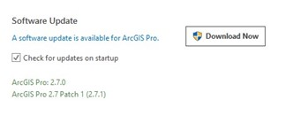

# Getting Started

Ensure that the prerequisites are met prior to training.

### Prerequisites

1. Access to NPS Portal for ArcGIS ([**https://gisportal.nps.gov**](https://gisportal.nps.gov/)).
2. ArcGIS Pro latest version 3.x installed
3. Download training data

## STEP 1: Access to NPS Portal for ArcGIS ([**https://gisportal.nps.gov**](https://gisportal.nps.gov/)).

<!-- ToDo: Get instructions -->

## STEP 2.a ArcGIS Pro Install

ArcGIS Pro beyond version 3.3.0 requires installation of Microsoft .NET Desktop Runtime 8.0.0 or a later patch release (8.0.1 and so on).

### Microsoft .NET Desktop Runtime 8.0.0 installation

1. Check your computer architecture on your Windows OS.

   a.  Type **system** in the **Search** bar at the bottom of the screen.

   

   b. Click **System Information**.

      

   c. Find **System Type** in *System Information* window.

      

2. Go to the link [Download .NET 8.0](https://dotnet.microsoft.com/en-us/download/dotnet/8.0).

3. Download ```.NET Desktop Runtime 8.x.x``` by clicking one of your computer architectures.

   

4. After download completed, click ```windowsdesktop-runtime-8.x.x-win-{architecture}``` installer and follow steps.


### ArcGIS Pro Install

1. <!--Click this link--> Click this link {ToDo: add link} and follow the instructions listed on the page.

## STEP 2.b Updating ArcGIS Pro

1. Open ArcGIS Pro. Users must be logged into Pro before updates can be made.
2. Select the **Settings** option in the bottom left corner
3. Select the **About** tab if it does not appear automatically.
4. If ArcGIS Pro is not running the most updated version, a similar message will appear. Admin/IT approval is required to apply any software updates. Any updates here will require Pro to close after successful installation.

   


## STEP 3: Download the data

<!-- ToDo: Check link and steps -->

1. If using the IMR GIS recommended [Park GIS Data Structure](https://imrgis.nps.gov/storage/app/media/Documents/Data-Management/GISDataStructure-May2019.pdf) navigate to the ```*Drive*:\GIS\Training\IMR_GPS_Training``` and create a new folder called ```Mobile Data Collection Training```. Users should download the Training Materials folder to the newly created ```Mobile Data Collection Training``` folder.

2. If the Park GIS Data Structure is **not** implemented, navigate to the Documents
folder (C:\Users\\{username}\Documents) and create a new folder called ```Mobile Data
   Collection Training```. Users should download the Training Materials folder to
   the newly created ```Mobile Data Collection Training``` folder. This will be our
   ```working folder``` for the rest of the exercises.

3. Create ```Projects``` folder under the ```working folder```.

<!-- END -->
<br>
<br>
<br>
<br>
<br>


