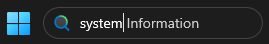
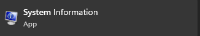
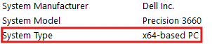
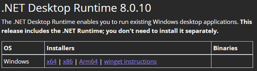
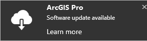
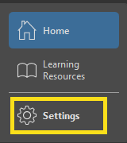
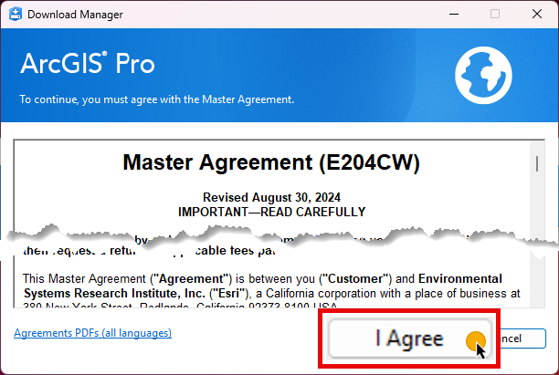
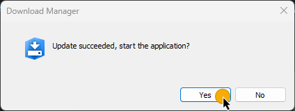

# Getting Started

Ensure that the prerequisites are met prior to training.

### Prerequisites

1. Access to NPS Portal for ArcGIS ([**https://gisportal.nps.gov**](https://gisportal.nps.gov/)).
2. ArcGIS Pro latest version 3.x installed
3. Download training data

## STEP 1: Access to NPS Portal for ArcGIS ([**https://gisportal.nps.gov**](https://gisportal.nps.gov/)).

<!-- ToDo: Get instructions -->

## STEP 2 (a) ArcGIS Pro Install

ArcGIS Pro beyond version 3.3.0 requires installation of Microsoft .NET Desktop Runtime 8.0.0 or a later patch release (
8.0.1 and so on).

### Microsoft .NET Desktop Runtime 8.0.0 installation

1. Check your computer architecture on your Windows OS.

   a. Type **system** in the **Search** bar at the bottom of the screen.


​	

​	b. Click **System Information**.

​	

​	c. Find **System Type** in *System Information* window.

​	

2. Go to the link [Download .NET 8.0](https://dotnet.microsoft.com/en-us/download/dotnet/8.0).

3. Download ```.NET Desktop Runtime 8.x.x``` by clicking one of your computer architectures.

​		

4. After download completed, click ```windowsdesktop-runtime-8.x.x-win-{architecture}``` installer and follow steps.

### ArcGIS Pro Install

1. <!--Click this link--> Click this link {ToDo: add link} and follow the instructions listed on the page.

## STEP 2 (b) Updating ArcGIS Pro

> [!IMPORTANT]
>
> Admin/IT approval is required to apply any software updates. Any updates here will require Pro to close after
> successful installation.

Open ArcGIS Pro. Users must be logged into Pro before updates can be made.
<ol>
   <li>
      <p>The "<i>Software Update</i>" notification will appear in the top right corner of ArcGIS Pro when an update is available. Click it if you see it.<br>
      <br>
      Otherwise, click <b>Settings</b> at the left. This will take you to the <a href="../../assets/images/arcgispro-about.png">About</a> page.</p>
      
   </li>

   <li>
      <p>Click 
      .
      </p>
   </li>

   <li>
      <p><i>"Do you want to allow this app to change your device?"</i> appears in the <i>User Account Control</i> window. 
      Click <b>Yes</b>.</p>
   </li>

   <li>
      <p>Click <b>I agree</b> in <i>Download Manager</i>.</p>
      
   </li>

   <li>
      <p>Click <b>Yes</b> in <i>Download Manager</i>.</p>
      
   </li>
</ol>

## STEP 3: Download the data

<!-- ToDo: Check link and steps -->

1. If using the IMR GIS
   recommended [Park GIS Data Structure](https://imrgis.nps.gov/storage/app/media/Documents/Data-Management/GISDataStructure-May2019.pdf)
   navigate to the ```*Drive*:\GIS\Training\IMR_GPS_Training``` and create a new folder called
   ```MobileDataCollectionTraining```. Users should download the Training Materials folder to the newly created
   ```MobileDataCollectionTraining``` folder.

2. If the Park GIS Data Structure is **not** implemented, navigate to the Documents
   folder (C:\Users\\{username}\Documents) and create a new folder called ```MobileData
   CollectionTraining```. Users should download the Training Materials folder to
   the newly created ```MobileDataCollectionTraining``` folder. This will be our
   ```working folder``` for the rest of the exercises.

3. Create ```Projects``` folder under the ```working folder```.

<!-- END -->
<br>
<br>
<br>
<br>
<br>


