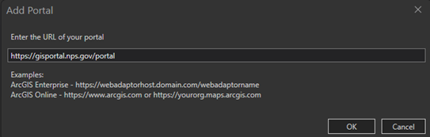
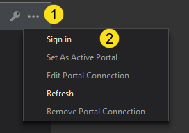
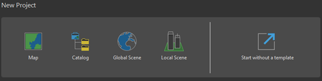
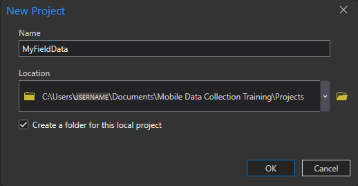
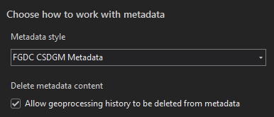
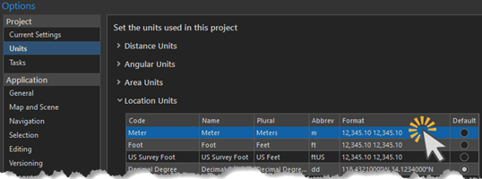
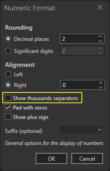
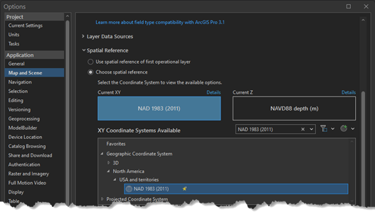
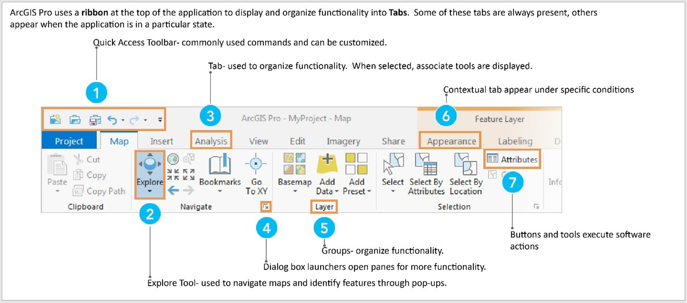

# Creating an ArcGIS Pro Project

<!-- ToDo: VPN = "Pulse Secure"? -->
> [!NOTE]
>
> If taking this training remotely, you must VPN in (Pulse Secure).

## STEP 1: Create an ArcGIS Pro Project

1. Open **ArcGIS Pro** > click **Settings** at the bottom left when application opens.

2. Select the **Portals** tab.

3. Click the **Add Portal**  > enter **https://gisportal.nps.gov/portal** > click
   **OK**.

   

4. Right click *nps.maps.arcgis.com* > select **Set as Active Portal**. A green
   check will appear over the icon.

   

5. Right click *nps.maps.arcgis.com* > click **Sign In** > Right click the **Portal** > click **Sign In.**

6. Click the *Enterprise login* button > select **National Park Service**.

7. Click the **Back** button at the top left of the Pro blue windowpane.

8. Create a new blank project by clicking on the **Map** to bring up the create
   project dialog box.

   


   > [!NOTE]
   >
   > When creating a new ArcGIS Pro Project, an empty toolbox and empty geodatabase are created automatically. Their titles will match the name of the New Project.

9. Name the project **MyFieldData** (camel case, all one word), and save it to your working folder\Projects. Verify the **Create a new folder for this project** box is checked. Click **OK.**

    


## STEP 2: Setting ArcGIS Pro Environments

The purpose of setting up ArcGIS Pro Environments is to create consistency when working within your projects. It allows you to set units and set coordinate system for your individual projects.

1. Select the **Project** tab > click **Options.**

2. On the left-hand panel, scroll down and click **Metadata.** In the drop down, select **FGDC CSDGM Metadata.** This is the form of metadata that is used by the Park Service.

   

   > [!NOTE]
   >
   > FGDC CSDGM Metadata, where FGDC stands for Federal Geographic Data Committee and CSDGM stands for Content Standard for Digital Geospatial Metadata is a specific standard format and standard the NPS uses to ensure consistency when writing “data about data.”

3. On the left-hand panel, click **Units.** Click the **Location Units** drop-down and in the **Meter** row, left-click the space under **Format**.

   

4. A Numeric Format pop-up will appear. **Uncheck** the “Show thousands separators” box. Click **OK**.

   

5. Under Default, left-click and select **Meter**.

   > [!TIP]
   >
   > There is an option to set coordinate systems. On the left-hand side, click **Map and Scene** and click the drop-down arrow next to **Spatial Reference** and select **Choose spatial reference.** Navigate to the coordinate system NAD 1983 (2011) under the Geographic Coordinate System tab for **Current XY**. If the Z coordinates setting is required for the project, navigate to the coordinate system NAVD88[[MS1\]](#_msocom_1) depth (m).

   

6. Click **OK** then click **Back** in the top left of the screen to navigate back to the map.


## STEP 3: Explore the Pro Interface

1. Take a few minutes and explore the ribbon on the top of the project. This interface is different from ArcMap, but it organizes the same functions into tabs and groups.

    

## STEP 4: Create Folder Connections

1. In the **Catalog** pane (if it is not open, click on the View tab then click the Catalog Pane button) from the **Windows** group. From the Project Tab, expand **Databases**. Note the geodatabase that was created in the last step (MyFieldData.gdb) is listed. The little house icon over the grey cylinder indicates that it is currently the default geodatabase for this project, meaning when data is created, it will be stored in this geodatabase.

   > [!NOTE]
   >
   > Notice that a .gdb (file geodatabase) extension is being used. This is different than a shapefile (.shp), another common file format for GIS data. It is *highly recommended* to use file geodatabases and feature classes (individual GIS data layers stored within a file geodatabase) vs. shapefiles for many data management purposes. Click [here](https://www.esri.com/news/arcuser/0309/files/9reasons.pdf)[ ](https://www.esri.com/news/arcuser/0309/files/9reasons.pdf)for further documentation on file geodatabases. For additional data management best practices, please see the data management webinar [here](https://imrgis.nps.gov/storage/app/media/Webinars/IMR-GIS-Webinar-GIS-Data-Management-20190612-1706-1.mp4)[ ](https://imrgis.nps.gov/storage/app/media/Webinars/IMR-GIS-Webinar-GIS-Data-Management-20190612-1706-1.mp4)[[MS2\]](#_msocom_2) from June 2019.

2. In the project, open the **View** tab.
3. Click the **Catalog View** button to open the Catalog. An expanded Catalog view will occupy the area once held by the map view.
4. In **Catalog** tab, select **Folders.**
5. Right-click in the folders window and select **Add Folder Connection**.
6. Navigate to and select the **working folder** created for this training. Click **OK**.
7. Right-click the newly added folder in the Contents View and select **Add to Favorites**.

   > [!TIP]
   >
   > Marking certain Folder Connections as Favorites allows users to access those connections instantly for future Pro projects to save time.

8. To see favorites, open the **Catalog** pane under the **View** tab, and select **Favorites.**

   > [!NOTE]
   >
   > These steps can be repeated for any number of folders or network drives specific to a park/office. These steps can also be used to connect to geodatabases and toolboxes.

   > [!IMPORTANT]
   >
   > If connecting a network drive, **DO NOT** rename it. This will rename the drive for every other user.

## STEP 5: Import a Map into the Project

1. Click the **Insert** tab.
2. In the **Project** group > click **Import Map**.
3. Browse to the ```working folder\Map Packages``` > select the
   ```Training_DataCollection_Exercise2.mpk``` > click **OK**.

   > [!NOTE]
   >
   > * This action imports a map document into Pro through a map package (.mpk). A locally stored ArcMap document (.mxd) can be imported into ArcGIS Pro the same way.
   > * ✅The newly imported map is now part of the ArcGIS Pro project.

## STEP 6: Navigate the Map

1. On the left side of the ArcGIS Pro project, observe the **Contents** pane. The
   **Contents** pane lists the layers contained in a map or scene. The **Contents** pane can also be used to manage the display of layers, symbology, and other layer properties.

   > [!NOTE]
   >
   > If the Content pane is not open, click the  **View**  tab then the  **Contents** icon.

2. On the **Contents** pane under **Drawing** Order, **_slowly double-click_** the the
   name of the map to **BAND Overview** as the data for this exercise is from
   _Bandelier National Monument_.

   > [!NOTE]
   >
   > Users should replace PARK with their own Park Unit Code throughout this training.

3. Click to highlight the **Point of Interest** layer. Notice now that a layer is highlighted, additional tabs appear on the top ribbon, highlighted in orange under **Feature Layer**.

4. If the Symbology pane is not already open, click the **Appearance tab** then the **Symbology** icon under the **Drawing** group.

5. On the Symbology Pane, under **Primary symbology** choose **Unique Values** from the drop-down then select **Point Label** from the Field 1 drop-down.

   ✅The symbology has changed from representing all Points of Interest the same way to having different symbols for each value based on the Point Label field. This change is visible in the Contents pane.

6. Click the **Map tab**. The default tool in Pro to navigate around the map is the Explore tool under the **Map** tab in the **Navigate** group. Hovering the mouse cursor over the tool will cause a list of commands to appear.

7. Click on the **map** and then **drag** the map in any direction to have the display area change.

8. On the **Map** tab, click the Previous Extent button in the same **Navigate** group to return to the previous extent.

9. Use the **mouse wheel** to zoom in and out. Zooming in and out continuously can also be accomplished by **holding a right click** and **moving the mouse forwards or backwards**.

10. On the **Map** tab in the **Navigate** group, click the **Full Extent** button. The map zooms to the full extent of the GIS data in the project.

11. In the **Contents** pane, **right-click** on **Point of Interest** and choose **Zoom to Layer**. The map zooms to the full extent of the Point of Interest data layer.

## STEP 7: Explore the Create Features and Modify Features Pane

1. On the ribbon, click the **Edit** tab.

2. In the Features group, click the **Create** button. This activates the Create Features pane and shows the different feature symbols that are used in each layer of the project’s map.
3. In the **Create Features** pane, click **Point of Interest** and select **Painted Cave**.
4. In the northwestern corner of the park boundary, click the map to **add a point**. The newly added point is highlighted to see it easily.
5. In the Contents pane, **right-click** on **Point of Interest**, then select **Attribute Table**. The newly created point’s attribute information is similarly highlighted. Scroll through to find the highlighted entry in the attribute table.

   > [!NOTE]
   >
   > In the attribute table, all attributes are filled in as <Null>. These attributes can be manually populated with data, however, this will be accomplished later in the training, so manual entry is unnecessary at this point.


6. To unselect the current point, click Clear in the attribute table.

7. Click the **X** to **close** the attribute table**.**

8. On the **Edit** tab, click the **Modify** icon

   > [!TIP]
   >
   > If there are too many panes open within the project, click the at the top right to pin the pane to the side of the project. Similar to ArcMap, the ArcGIS Pro display can be customized by clicking and dragging panes to different sides of the program.

9. In the **Modify Features** pane, click **Move** to change the location of a point. Select a Point of Interest feature by clicking one and it will be highlighted. A small menu bar of additional modifications appears at the bottom of the map view.

10. Once highlighted move the point to the southwest corner of the park.

11. Click the **Save** icon in the **Edit** tab under the **Manage Edits** group. Click **Yes** to Save all edits. To **Discard** edits (if needed), click the **Discard** icon in the same group.

<br>
<br>
<br>
<br>
<br>
