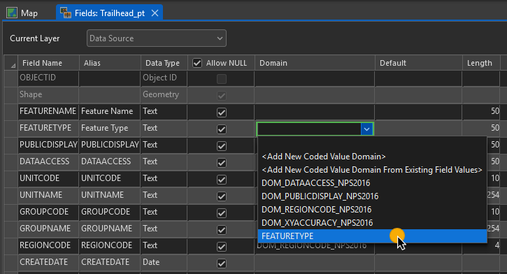

# Build a Geodatabase

In this exercise, utilize ArcGIS Pro to convert a shapefile to a feature class and create a new feature class from scratch.


## STEP 1: Connect to necessary folders and databases

Setting up connections to toolboxes, databases, folders, styles, layouts, etc. will help streamline your data management workflows. Recall that when creating an ArcGIS Pro Project, an empty toolbox and empty geodatabase are also created.

1. If not already open, open _ArcGIS Pro_ and open the **MyFieldData** project.
2. In the **Catalog** pane, in the **Project** tab, right-click **Toolboxes**  > click **Add Toolbox** 
3. Navigate to your **working folder/Tools** > select _Data Standards Toolbox.pyt_ > click **OK** 
4. Repeat step 2 and 3 for the _Attachments toolbox/Attachments.pyt_ we’ll use in later exercises
5. Click the **insert** tab > click **Add** under the **Styles** group > click **Add Style** 
6. Navigate to the **working folder/Styles** > select the _nps-symbols_2.0.0.stylx_ > click **OK** > If prompted to upgrade the style file, click **OK**.


## STEP 2: Importing shapefiles into a Geodatabase

```Review the advantages to managing geospatial data in file geodatabases rather than in shapefiles. This data model is implemented in the Park GIS Data structure recommended by IMR GIS.```

✅Make sure the PARK Overview map view from Exercise 2 has been closed within the Pro Project.
  Mobile Data Collection Training Lakewood Regional Office doimspp.sharepoint.com/sites/nps-imr-geographic-resources Geographic Resources Division
  May 2022 Page 25

1. In the **Catalog** pane, right-click *PARK_TRANS_TRAINING_ParkingLots_py.shp* under **working directory/Data** > click **Properties**
2. Check coordinate systems under **Spatial Reference** 

​	Projected coordinate system is a WGS 1984 geographic coordinate system, which needs to be converted to the NPS standard of NAD 1983 (2011).

3. Right-click *MyFieldData.gdb* > harvering over **Import** > click **Feature Class(es)** >  **Feature Classes To Geodatabase** tool opens<br>
    Alternatively, you can click  **Analysis** > click **Tools** button in the *Geoprocessing* group > in the **Find Tools** search box of the **Geoprocessing** pane > type **Feature Class To Geodatabase**  into the search bar

4. Click **Browse** folder button  > navigate to the files as below
   * **Input Features**: {working directory}\Data\PARK_TRANS_TRAINING_ParkingLots_py.shp

   * **Output Geodatabase**: MyFieldData.gdb
    

5. Click **Environments** tab in the tool > click <u>globe icon</u> next to *Output Coordinate System*

6. In the **Output Coordinate System** window, enter "*nad 1983 (2011)*" in the *Search* box > press **Enter**

7. Click collapsible arrow icon next to **Projected Coordinate System** > **UTM** > **North America** > **NAD 1983 (2011)** > **NAD 1983 (2011) UTM ZoneXX** (choose the UTM zone for your current location.) > click **OK**

8. Select *WGS_1984_(ITRF08)_To_NAD_1983_2011)* for **Geographic Transformations** > click **Run**

9. "*Feature Class To Geodatabase completed.*" message appears at the bottom > click blue links to check details

    


10. Right-click the PARK_TRANS_TRAINING_ParkingLots_py > select **Properties**

11. Under **Source**, locate **Alias** > change to *ParkingLots_py* > Click **OK**

    

12. Right-click *PARK_TRANS_TRAINING_ParkingLots_py* under **MyFieldData.gdb** > click **View Metadata** > it will open **Catalog** in the center window > click *PARK_TRANS_TRAINING_ParkingLots_py* > explore **Metadata**, **Geography**, and **Table** tabs
    Scrolldown to  the **Geoprocessing history** and **Fields** in the **Metadata**.<br>

    If you want to see in ordered list of "Geoprocessing history", right-click *PARK_TRANS_TRAINING_ParkingLots_py* under **MyFieldData.gdb** > click **Edit Metadata** > in the **Contents** pane, select **Geoprocessing History** > You can learn processes of  this feature class

13. Close **Catalog** and **PARK_TRANS_TRAINING_ParkingLots_py** tabs.

14. In the Catalog pane, right-click *PARK_TRANS_TRAINING_ParkingLots_py* > select **Add to Current Map** > click the Map view.
      ✓ The renamed ParkingLots_py layer is added to the map and appears in the Contents pane.

    Alternatively, the layer can be dragged from the **Catalog** pane to the **Map** pane.

## STEP 3: Create point feature class for GNSS data collection

Here you will create a new point feature class using the **Create Feature Class** tool. This feature class should be named *PARK_TRANS_TRAINING_Trailhead_pt* in *MyFieldData.gdb*. It should have the geographic coordinate system *GCS_NAD_1983_2011* and no linear dimensions (has M) or elevations (has Z).


| <!-- -->                                                                                                                                                                                                                                                                                                                                                                                                  | <!-- -->|
|:----------------------------------------------------------------------------------------------------------------------------------------------------------------------------------------------------------------------------------------------------------------------------------------------------------------------------------------------------------------------------------------------------------|:----|
| **Feature Class Location:** MyFieldData.gdb<br>**Feature Class Name:** PARK_TRANS_TRAINING_Trailhead_pt<br>**Geometry Type: Point**<br>**Template Datasets:** blank<br>**OID Type:** Same as template<br>**Has M:** No<br>**Has Z:** No<br>**Coordinate System:** GCS_NAD_1983_2011<br>**Feature Class Alias:** Trailhead_pt<br> |  |


## STEP 4: Create metadata for new feature class

Users will now complete the metadata details for the Trailhead feature class. Completing the metadata is a good practice and the information will be automatically included while sharing layers.

1. Click **View** in the ribbon tabs > click **Catalog View**

    

2. In the **Catalog View** (image below), double-click **Databases** > double-click **MyFieldData.gdb** > click **PARK_TRANS_TRAINING_Trailhead_pt** feature class > see the **Metadata**

    

3. The **Catalog** ribbon tab is selected > click __Edit__ in **_Metadata_** group.

    

    Alternatively, right-click *{working directory}/MyFieldData.gdb/PARK_TRANS_TRAINING_Trailhead_pt* in **Catalog** pane > click **Edit Metadata**

   > [!NOTE]
   >
   > There are boxes highlighted in red. These fields are **required** to be compliant with the FGDC CSDGM Metadata standards. Use [*this*](https://pro.arcgis.com/en/pro-app/help/metadata/create-fgdc-csdgm-metadata.htm)[ ](https://pro.arcgis.com/en/pro-app/help/metadata/create-fgdc-csdgm-metadata.htm)link to learn more about completing the FGDC CSDGM Metadata. Metadata can be saved without a green check for each item; **however,** it is best practice to fill out as much as possible. <br>
    

4. In the **Item Description**, fill out as following:

     | <!-- -->         | <!-- -->                                                     |
     | ---------------- | ------------------------------------------------------------ |
     | **Title:**       | PARK_TRANS_TRAINING_Trailhead_pt                             |
     | **Tags:**        | PARK, data collection, transportation, training              |
     | **Summary**:     | Point feature class for collecting trailhead location data.  |
     | **Description:** | The point feature class hosts descriptions on trailhead location data collected in the field. Attribute fields include Feature Name, Feature Type, Public Display, Data Access, Unit Code, Unit Name, Group Code, Group Name, Region Code, Create Date, Create User, Edit Date, Edit User, Map Method, Map Source, Source Date, XY Accuracy, Geometry ID, and Notes. |
     | **Credit:**      | Maintenance, Facilities, PARK, National Park Service         |

   

5. Click **New Use Limitation**

   | <!-- --> | <!-- --> |
   |----|----|   
   |**Use Limitation**:|These data exist to assist park staff maintain trailhead asset information. This data may not be appropriate for public consumption.|

   > [!TIP]
   >
   > For larger park units, it is useful to set an appropriate scale range.

   

7. Leave the **Bounding Box** blank

8. From the **Metadata** tab, in the **Manage Metadata** group > click **Save**

   > Check ✅: *Select the **PARK_TRANS_TRAINING_Trailhead_pt** feature class in the **Catalog** view. The updated metadata can be seen to the right of the highlighted layer.*

9. **Close** the **PARK_TRANS_TRANING_Trailhead_pt** metadata view.

## STEP 5: Design attribute fields

In this step, users will create two attribute fields for the Trailhead layer: Feature Name and Feature Type.

1. In the **Catalog** view, right-click **PARK_TRANS_TRAINING_Trailhead_pt** > point to **Design** and then click **Fields**

    

2. Click **Click here to add a new field** 
    

  > [!NOTE]
  >
  > ObjectID and Shape are required fields that are automatically generated in every feature class. They will be greyed out.

3. Enter the fields information for the feature name and feature type

    

4. Check over work, **Save** changes > close the **Fields** view > close **Catalog** view .

5. In the Quick Access Toolbar, click the **Save Project** button to save the project

    


## STEP 6: Create geodatabase domains

Choosing attribute values from a list improves overall data quality and increases data collection efficiency. The attribute field and the domain must have the same data type (ex. Text). Next, create the Feature Type geodatabase domain, then assign that domain to the Feature Type attribute field later in Step 7.

1. In the **Catalog** pane, on the **Project** tab, under **Databases**, right-click **MyFieldData.gdb** > click **Domains**.

   

2. Click **Click a domain to add a new domain**.

    

3. In the Domains view, in the first row, enter the following information:

    

3. In the grid on the right of the **Domains** view, type the code and descriptions according to the image below. Review work and correct any spelling errors.
   %% Add Image

   > [!TIP]
   >
   > A green cell to the left of a row indicates unsaved changes. A red cell indicates that there is an error that must be corrected before changes can be saved.<br>
   > ✅At least one coded value and description must be entered for a **Coded Value Domain**. No value or description cell may be left blank.<br>
   > ✅To delete an unwanted coded value or domain, select the row, then click **Delete** in the **Domains** tab, **Clipboard** group.<br>
   > ✅Empty cells within the domain list cannot be deleted.

4. Click **Save** > close the **Fields** view > click the **Save** in *Quick Access Toolbar* (ctrl+s) to save the project


## STEP 7: Add Core Standard and GNSS metadata fields

We will now add on the NPS Core Standard metadata fields. These fields provide feature level metadata and help future users of the data understand the data’s integrity. At this time, NPS data standards exist for roads, trails, buildings, and cultural resources and should be used for those feature types. For any other feature types, using the Core Standard metadata fields is a best practice.

1. In the **Catalog** pane, on the **Project** tab, open the **Toolboxes** folder, open **Data Standards Toolbox.pyt** and double-click the **Add Fields** and **Assign Domains** script.

    

2. In the Reference Feature Class box, browse to your working *folder\Standards\NPS_CORE_20160810*. Double-click on the *NPS_CORE_20160810.gdb* and select *CORE_pt.* Click OK.

    

4. In the **Target Feature Class** box, browse to and double-click on *MyFieldData.gdb*. Select *PARK_TRANS_TRAINING_Trailhead_pt* and click **OK**.

    

5. In the **Manage Existing Fields** box, select **Modify Field**.

   > [!NOTE]
   >
   > The Manage Existing Fields box defines the method for handling existing fields in the target feature class. The Modify Field option will modify or change the fields to match the source feature class. If the field cannot be modified, it will be renamed, and a new field will be added. The Rename Field option will rename the existing fields with a _Timestamp. The Ignore Field option will ignore existing fields with the same name and only add missing fields.

   <!--Add Image-->

5. Click **Run** at the bottom of the pane.

6. When the **Add Fields** and **Assign Domains** tool has successfully completed, if still open close the **Catalog** view . **Save** the project.

## STEP 8: Assign domains and standardize fields

1. In the **Catalog** pane, in the *MyFieldData.gdb*, right-click *PARK_TRANS_TRAINING_Trailhead_pt* and select **Data Design** then **Fields**.

2. Assign the *FEATURETYPE* domain to the **Feature Type** domain field by clicking in the column for field > select *FEATURETYPE* from the drop-down.

    

3. Check to ensure the domains are assigned to the Core Standard fields > rename *Alias* as shown step 4 

4. To make data collection more time efficient in the field, assign default values to *Unit Code*, *Unit Name*, *Map Method*, and *Map Source* as table below. These fields can be changed while out collecting data if necessary.  

   | <!-- -->       | <!-- -->|
   | -------------- | -------------- |
   | **Unit Code**  | *Your Unit Code* |
   | **Unit Name**  | *Your Unit Code* |
   | **Map Method** | Autonomous GPS |
   | **Map Source** | Samsung Tab Active 2 |

   

   > [!NOTE]
   >
   > Currently, Field Maps does not support GNSS metadata for lines or polygons. This document will be updated when support for lines and polygons becomes available.

5. In the tool ribbon at the top of ArcGIS Pro, click **Save** in the *Manage Edits* group

6. In the **Geoprocessing** pane, click the back button > In the *Find Tools* search box, type *GPS* > click **Add GPS Metadata Fields** tool

   *If the Geoprocessing pane is not already open, open it by clicking into the View tab and then click the Geoprocessing icon.*

7. In the **Input Point Features** drop-down, select *Trailhead_pt*  >click **Run**<br>
     ✅New fields starts with "ESRI" were added to the Trailhead Point layer.

8. Close the **Fields** view > **Save** (ctrl+s) the project

The project is now ready to share to  Portal. If continuing to the next exercise, keep the MyFieldData project open.
<br>
<br>
<br>
<br>
<br>

