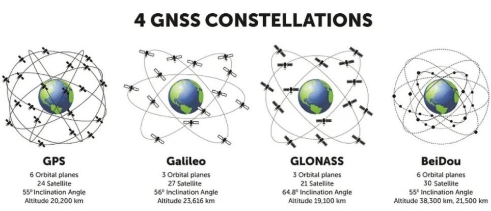
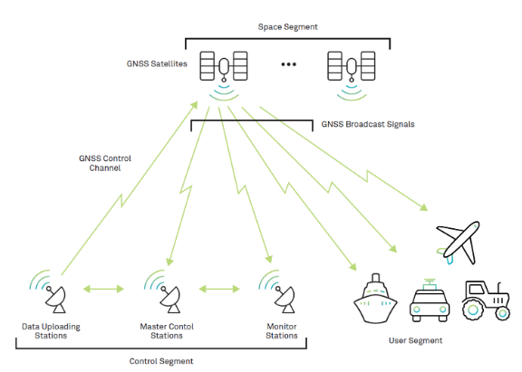
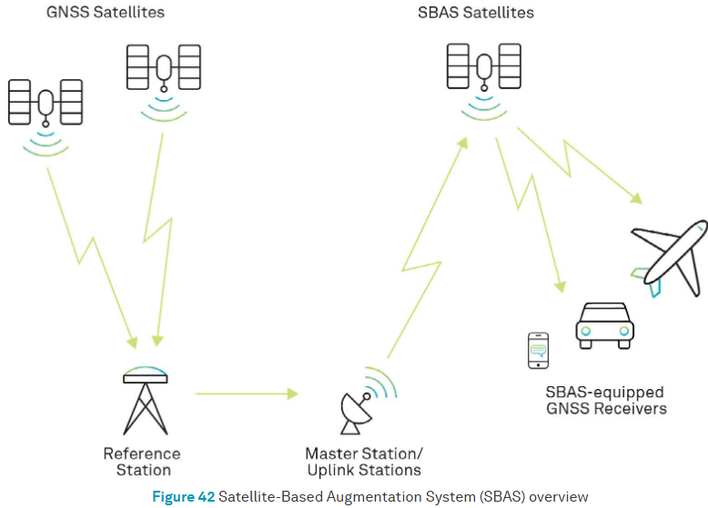

# Global Navigation Satellite System (GNSS)

GNSS is a global network of satellites, whose orbits and timing are broadcast by satellite for the purposes of navigation and positioning.

## GNSS Constellations
A satellite constellation is a network of similar artificial units with shared control, communicating with global ground stations and designed to work together as a system.

* [GPS (USA)](https://www.faa.gov/about/office_org/headquarters_offices/ato/service_units/techops/navservices/gnss/gps), 
* [GLONASS (Russia)](https://glonass-iac.ru/en/about_glonass/), 
* [Galileo (European Union)](https://www.euspa.europa.eu/eu-space-programme/galileo), 
* [BeiDou (China)](http://en.beidou.gov.cn/), and 
* others ([IRNSS/NavIC (India)](https://www.ursc.gov.in/navigation/irnss.jsp),
[QZSS (Japan)](https://qzss.go.jp/en/overview/services/sv02_why.html)).

 
*Image: 4 GNSS constellations [^5]* 

**Updates:** 
The number of satellites and their operational status changes over time. This information pertains to April 2023.
* GPS - 31 satellites (31 operational)[^2][^6] 
* GLONASS - 25 satellites (24 operational)[^6] 
* Galileo - 28 satellites (24 operational)[^6] 
* BeiDou - 29 satellites (27 operational)[^6] 

## GNSS Architechture
GNSS systems are composed of three segments: 

1. **Space segment** - 
Series of satellites continuously transmit signals.

2. **Ground segment** or **Control segment** - 
Consists of ground-based monitor stations, master control stations, and upload stations.
    * **Monitor stations**: Track the satellite continuously and send tracking information to the master control station. 
    * **Master control stations**: Process recieved infomation to correct satellite orbit and clock errors and forward it to the upload station.
    * **Upload station**: Transmit the correction to each satellite at lease once every day.

3. **User segment** - User's GNSS receiver.

Bhatta, B. (2021). Functional Segments of GNSS. Global Navigation Satellite Systems: New Technologies and Applications (2nd ed.). CRC Press. https://doi.org/10.1201/9781003148753

 
*Source [What are Global Navigation Satellite Systems?](https://novatel.com/tech-talk/an-introduction-to-gnss/what-are-global-navigation-satellite-systems-gnss), NovAtel*

## GNSS Signal
https://usq.pressbooks.pub/gpsandgnss/chapter/3-4-gnss-signals/
### Key components of a GNSS signal:
**Carrier wave:**
A radio frequency sinusoidal signal with a specific frequency used for precise timing measurements. 

**Ranging code:**
A unique sequence of bits (0s and 1s) transmitted by each satellite, allowing the receiver to calculate the travel time of the signal. 

**Navigation message:**
A data stream containing information about the satellite's position, clock status, health, and other relevant data. 
Information included in the navigation message:

- **Satellite ID:** Identifies the transmitting satellite
- **GPS time:** Precise time information from the satellite
- **Ephemeris data:** Detailed orbital information about the satellite's position
- **Almanac data:** Less precise orbital information about all 
satellites in the constellation
- **Satellite health status:** Indicates if the satellite is functioning properly 

### How GNSS positioning works:
- **Signal reception:** A GNSS receiver picks up signals from multiple satellites. 
- **Ranging code decoding:** The receiver measures the time it takes to receive the ranging code from each satellite, which is used to calculate the distance to the satellite. 
- **Triangulation:** By using the distances to multiple satellites, the receiver can calculate its own 3D position on Earth. 

## GNSS Argumentations
Augmenting a global navigation satellite system (GNSS) enhances its performance in terms of **_accuracy_**, **_reliability_**, and **_availability_** by incorporating external information into the user's position solution.

**Satellite Based Augmentation Systems (SBAS)** 
SBAS are geosynchronous satellite systems receive correction information from the control segment and transmit it to user segments. 

**Implemented SBAS services:**
Global
* Wide Area Augmentation System (WAAS) (United States)
* European Geostationary Navigation Overlay Service (EGNOS) (European Space Agency)
* BeiDou Satellite-Based Augmentation System (BDSBAS) (China)
Regional
* MTSAT Satellite Based Augmentation System (MSAS) (Japan)
* GPS-Aided GEO Augmented Navigation (GAGAN) system (India)

*Source: [Satellite Based Augmentation System (SBAS)](https://novatel.com/an-introduction-to-gnss/resolving-errors/sbas), NovAtel*

*Ground Based Augmentation System (GBAS)* 
GBAS was initially referred to as the Local Area Augmentation System (LAAS). Networks of GBAS use VHF or UHF frequencies and provide localized reception within tens of kilometres of receivers and it is primarily used in aviation purposes. [see](https://www.faa.gov/airports/planning_capacity/non_federal/gbas)

[^1]: [What is the difference between GNSS and GPS?](https://www.mobatime.com/article/difference-between-gnss-and-gps/), MOBATIME, 2021-05-26. 

[^2]: [Satellite Navigation - Global Positioning System (GPS)](https://www.faa.gov/about/office_org/headquarters_offices/ato/service_units/techops/navservices/gnss/gps#:~:text=Currently%2031%20GPS%20satellites%20orbitand%20in%20all%20weather%20conditions), Federal Aviation Administration.

[^3]: [The Satellite Clock](https://www.e-education.psu.edu/geog862/node/1714#:~:text=However%2C%20this%20apparent%20slowing%20of,about%2045%20microseconds%20a%20day.), PennState College of Earth and Mineral Science.

[^4]: [Control segment](https://www.gps.gov/systems/gps/control/), GPS.gov.

[^5]: [What are the limitations of GNSS?](https://inertiallabs.com/what-are-the-limitations-of-gnss/) Inertial Labs, 2024-10-02.

[^6]: [GPS Overview Part 1: What is GPS and GNSS Positioning?](https://eos-gnss.com/knowledge-base/gps-overview-1-what-is-gps-and-gnss-positioning), EOS Positioning Systems.

---
https://www.faa.gov/about/office_org/headquarters_offices/ato/service_units/techops/navservices/gnss/gps/howitworks#:~:text=However%2C%20by%20taking%20a%20measurement,longitude%2C%20altitude%2C%20and%20time.
https://cmr.earthdata.nasa.gov/search/concepts/C1419766346-CDDIS.html

#### How GPS maintain accurate orbit and time
* Atomic clocks - typically measuring time to within a nanosecond (one billionth of a second). 
* Time dilation - Einstein's theory of relativity: the clocks on the satellites run slightly faster than clocks on 
Earth because of their high speed and lower gravity. [^3] 
* Orbit - GPS satellites orbit the Earth at a medium altitude, typically around 20,200 kilometers (12,540 miles)
and each satellite completes two orbits per day.
* Ground station monitoring - continuously monitor the satellite clocks and orbits, sending correction data to the 
satellites to maintain accuracy. [^4]