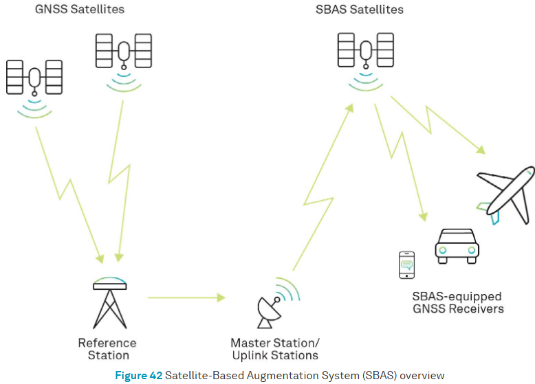

# Part 2: Global Navigation Satellite System (GNSS)

## How GNSS Works
* As GNSS require minimum of 4 satellites to calculate the position, 3 satellites for a location and 4th satellite for time synchronization. The more satellites the better the accuracy. *For more info ℹ️ a, b, c.*

* The satellites are in the orbit and the signals are transmitted to the GNSS receiver on the ground. *For more info ℹ️ d.*

* The receiver calculates the distance to each satellite based on the time it takes for the signal to reach the 
receiver. 
    >**Distance** = **Speed of light** (300,000km/s) x **Time** (taken for signal to travel from satellite to receiver) 
* The receiver then uses this information to determine its position on the Earth's surface. The accuracy of the position depends on the number of satellites, the geometry of the satellites, and the quality of the signals.

---
ℹ️ *More detail about topic:* 
[a] *[The Global Positioning System](https://oceanservice.noaa.gov/education/tutorial_geodesy/geo09_gps.html), NOAA - Web* 
[b] *[How GPS works? Trilateration explained
](https://www.youtube-nocookie.com/embed/4O3ZVHVFhes?playlist=4O3ZVHVFhes&autoplay=1&iv_load_policy=3&loop=1&start=), unfa🇺🇦 - YouTube* 
[c] *[Working of GPS | Why four satellites | How is time offset corrected](https://www.youtube-nocookie.com/embed/CMSCgAxDASc?playlist=CMSCgAxDASc&autoplay=1&iv_load_policy=3&loop=1&start=), Science for Common man - YouTube* 
[d] *[Understanding Satellite Frequencies and GNSS Receiver Channels](https://globalgpssystems.com/gnss/understanding-satellite-frequencies-and-gnss-receiver-channels/), Global GPS Systems - Web*

## Accuracy and Precision
The image below displays difference between accuracy and precision. 

 
*Source: [Global Navigation Satellite System (GNSS) And Satellite Navigation Explained](https://inertiallabs.com/gnss-and-satellite-navigation-explained/), InertialLabs, 2024* 

## GNSS Error Sources
Several factors can affect positioning accuracy, including satellite clocks, obituaries, atmospheric conditions, receiver noise, and multipaths.

 
*Source: [Chapter 4: GNSS error sources](https://novatel.com/an-introduction-to-gnss/gnss-error-sources), NovAtel* 
 
 

# GNSS Argumentations
Augmenting a GNSS correct errors and enhances its performance in terms of **_accuracy_**, **_reliability_**, and **_availability_** by incorporating external information into the user's position solution.

## Satellite Based Augmentation Systems (SBAS)
SBAS are GEO (Geostationary Earth Orbit) systems receive correction information from the control segment and transmit it to user segments. 

*Source: [Satellite Based Augmentation System (SBAS)](https://novatel.com/an-introduction-to-gnss/resolving-errors/sbas), NovAtel*

### Implemented SBAS services
* Wide Area Augmentation System (WAAS) (United States)
* European Geostationary Navigation Overlay Service (EGNOS) (European Space Agency)
* BeiDou Satellite-Based Augmentation System (BDSBAS) (China)
* MTSAT Satellite Based Augmentation System (MSAS) (Japan)
* GPS-Aided GEO Augmented Navigation (GAGAN) system (India)

 

---
ℹ️ *Ground Based Augmentation System (GBAS)* 
*GBAS was initially referred to as the Local Area Augmentation System (LAAS). Networks of GBAS use VHF or UHF frequencies and provide localized reception within tens of kilometres of receivers and it is primarily used in aviation purposes. For more information visit [Ground Based Augmentation System (GBAS)](https://www.faa.gov/airports/planning_capacity/non_federal/gbas), Federal Aviation Administration website*.
 
 

## Methods Used to Improve GNSS Accuracy
Generally GNSS accuracy is 2-10 meters depending on the number of satellites and the geometry of the satellites, 
but approximately 2 meters. However, there are methods to improve centimeter accuracy.
* Deferential GNSS (DGNSS)
* Real-Time Kinetic (RTK) positioning
* Precise Point Positioning (PPP)
* PPP-RTK
* Post-Processed Kinematic (PPK) positioning

### Differential GNSS (DGNSS)
 
*Source: [Differential GNSS (DGNSS)](hhttps://novatel.com/an-introduction-to-gnss/resolving-errors/differential-gnss), NovAtel* 
* Less expensive than RTK
* A longer baseline (distance between a base station and rover receivers)
* [Which Correction Methods](https://novatel.com/an-introduction-to-gnss/resolving-errors/which-correction-method#:~:text=DGNSS%20vs%20RTK&text=The%20difference%20is%20that%20RTK,a%20DGNSS%20is%20less%20expensive.)
[DGNSS](https://learnbyexample.in/content/ec/gnss/lec11.php)

### Real-Time Kinetic (RTK) positioning
* RTK is a type of DGNSS
* More accurate than DGNSS.
Real-Time Kinetic (RTK) positioning is a satellite navigation technique used to enhance the precision of position 
data derived from satellite-based positioning systems such as GPS, GLONASS, Galileo, and BeiDou. RTK positioning provides real-time corrections to the data received from GNSS (Global Navigation Satellite System) satellites, allowing for centimeter-level accuracy.  
- RTK is widely used in applications requiring high precision, such as surveying, agriculture, construction, and autonomous vehicles.
[RTk](https://novatel.com/an-introduction-to-gnss/resolving-errors/rtk)

## Key Components of RTK Positioning
**Base Station**: A fixed GNSS receiver at a known location that continuously receives satellite signals and calculates corrections.
**Rover**: A mobile GNSS receiver that applies the corrections received from the base station to its own satellite data to determine its precise position.
**Communication Link**: A data link (e.g., radio, cellular, internet) that transmits the correction data from the base station to the rover in real-time.

## Real-Time Kinetic (RTK) positioning is needed for several reasons  
- **High Accuracy**: Provides centimeter-level accuracy, which is essential for applications requiring precise positioning, such as surveying, construction, and agriculture.  
- **Real-Time Data**: Delivers real-time corrections, allowing users to obtain accurate position data instantly, which is crucial for time-sensitive operations.  
- **Reliability**: Improves the reliability of GNSS data by correcting errors caused by atmospheric conditions, satellite orbits, and clock discrepancies.  
- **Efficiency**: By providing accurate and real-time position data, RTK enhances the efficiency of field operations, reducing the need for post-processing and rework.  
- **Versatility**: Compatible with various GNSS systems (GPS, GLONASS, Galileo, BeiDou), making it a versatile solution for global positioning needs.  

Overall, RTK is essential for any application where high precision and real-time positioning are critical.

https://upload.wikimedia.org/wikipedia/commons/b/b4/Comparison_satellite_navigation_orbits.svg

# Networked Transport of RTCM via Internet Protocol (NTRIP)
NTRIP is a protocol designed to stream GNSS correction data over the internet for Real Time Kinematic (RTK) positioning. It is built on the HTTP/1.1 protocol and optimized for integration with RTK correction services. 

Key components of NTRIP include:  

- NTRIP Server: Streams GNSS data to the NTRIP Caster.
- NTRIP Caster: Acts as a relay, distributing data from the NTRIP Server to multiple NTRIP Clients.
- NTRIP Client: Receives GNSS data from the NTRIP Caster for use in real-time applications.
- NTRIP uses standard internet protocols (HTTP/HTTPS) and is designed to be lightweight and efficient, making it suitable for use over various types of internet connections.

## Radio Technical Commission for Maritime Services (RTCM)
RTCM is a non-profit international standards organization. RTCM has released internationally recognized standards for 

- maritime navigation, 
- communication equipment, 
- distress alert systems, and 
- satellite positioning technologies like GPS. 

These standards support various fields, including 

- transportation, 
- surveying, geodesy, 
- precision agriculture, and 
- autonomous vehicles, 

providing essential high integrity and centimeter-level accuracy.

# NPS NTRIP

https://www.gps.gov/cgsic/meetings/2021/smith.pdf

# Precise Point Positioning (PPP)
* Uses a global network of GNSS stations for precise 
satellite orbits and clock corrections and broadcast directory 
from satellites to GNSS receivers achieving centimeter-level 
accuracy. 
* Ideal for high-precision positioning in remote or 
challenging environments where RTK corrections are unavailable. 
* PPP can also be used with RTK to enhance accuracy and provide 
redundancy in critical applications (PPP-RTK)

# Precise Point Positioning (PPP) Services with EOS Arrow
* Galileo High Accuracy Service (HAS)
  * Initial Service on the 24th of January 2023
  * Global coverage (Service Level 1 (SL1)) -  typical convergence time of less than 300 seconds (5 minutes)
  * Regional coverage availability over the European Coverage Area (ECA) (Service Level 2 (SL2)) - convergence time will be lower than 100 seconds
  * Free of charge
  * Real-time corrections
  * Accuracy target (95%): 20cm (horizontal) / 40cm (vertical)
  * E6-B signal
  * Internet not required
  [EOS Positioning](https://eos-gnss.com/blog/galileo-high-accuracy-service-early-observations)
  Note: [Galileo HAS Internet Data Distribution](https://www.gsc-europa.eu/galileo/services/galileo-high-accuracy-service-has/internet-data-distribution) service also available.
  [FAQs on HAS](https://www.gsc-europa.eu/galileo/faq#HAS)  

[Have you met HAS? 22 Jan 2024](https://www.euspa.europa.eu/newsroom-events/news/have-you-met-has#:~:text=While%20SL1%20will%20have%20a,be%20lower%20than%20100%20seconds.)
[PPP Galileo HAS Technology: Pros and Cons](https://gpsgeometer.com/en/blog/pros-and-cons-of-ppp-galileo-has)

# Precise Point Positioning (PPP) Services with Leica SmartLink
* Subscription-based
* Correction based argumentation satellites
[SmartLink](https://leica-geosystems.com/en-us/products/gnss-systems/smart-antennas/leica-viva-gs16/life-beyond-traditional-rtk-satellite-based-precise-point-positioning)

# Post-Processed Kinematic (PPK) positioning
* Involves processing the raw GNSS data after the data collection.

## Correction Data
* NOAA Continuously Operating Reference Stations (CORS) - Free
[UFCORS](https://geodesy.noaa.gov/UFCORS/)
* NPS NTRIP 
* and more
