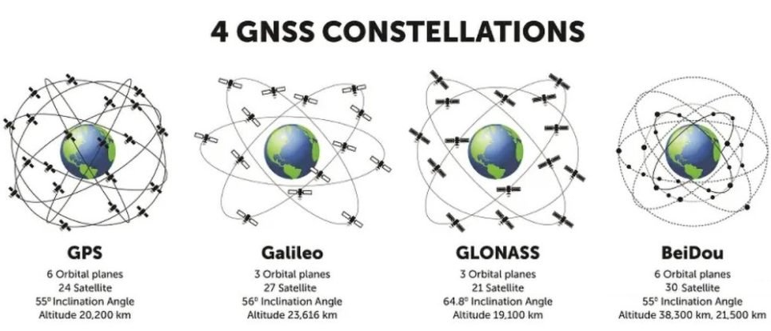

# Global Navigation Satellite System (GNSS)

# GPS vs GNSS

GPS (Global Positioning System) and GNSS (Global Navigation Satellite System) are both satellite-based navigation systems, but they have some differences.

 
*Image: GPS vs GNSS [^1]*

### GPS:
* Developed and maintained by the United States.
* Consists of a constellation of at least 31 satellites.[^2]
* Provides global coverage.
* Primarily used for navigation, mapping, and timing.

### GNSS:
* A broader term that includes all satellite navigation systems.
* Includes 
[GPS (USA)](https://www.faa.gov/about/office_org/headquarters_offices/ato/service_units/techops/navservices/gnss/gps), 
[GLONASS (Russia)](https://glonass-iac.ru/en/about_glonass/), 
[Galileo (European Union)](https://www.euspa.europa.eu/eu-space-programme/galileo), 
[BeiDou (China)](http://en.beidou.gov.cn/), and others ([IRNSS (India)](https://www.ursc.gov.in/navigation/irnss.jsp),
[QZSS(Japan)](https://qzss.go.jp/en/overview/services/sv02_why.html)).
* Provides more satellites and better coverage, especially in challenging environments.
* Offers improved accuracy and reliability by combining signals from multiple systems.

 
*Image: 4 GNSS constellations [^5]* 

### Updates: 
The number of satellites and their operational status changes over time. This information pertains to April 2023.
* GPS - 31 satellites (31 operational)[^2][^6] 
* GLONASS - 25 satellites (24 operational)[^6] 
* Galileo - 28 satellites (24 operational)[^6] 
* BeiDou - 29 satellites (27 operational)[^6] 

https://www.faa.gov/about/office_org/headquarters_offices/ato/service_units/techops/navservices/gnss/gps/howitworks#:~:text=However%2C%20by%20taking%20a%20measurement,longitude%2C%20altitude%2C%20and%20time.
https://cmr.earthdata.nasa.gov/search/concepts/C1419766346-CDDIS.html

#### How GPS maintain accurate orbit and time
* Atomic clocks - typically measuring time to within a nanosecond (one billionth of a second). 
* Time dilation - Einstein's theory of relativity: the clocks on the satellites run slightly faster than clocks on 
Earth because of their high speed and lower gravity. [^3] 
* Orbit - GPS satellites orbit the Earth at a medium altitude, typically around 20,200 kilometers (12,540 miles)
and each satellite completes two orbits per day.
* Ground station monitoring - continuously monitor the satellite clocks and orbits, sending correction data to the 
satellites to maintain accuracy. [^4]

[^1]: [What is the difference between GNSS and GPS?](https://www.mobatime.com/article/difference-between-gnss-and-gps/), MOBATIME, 2021-05-26. 

[^2]: [Satellite Navigation - Global Positioning System (GPS)](https://www.faa.gov/about/office_org/headquarters_offices/ato/service_units/techops/navservices/gnss/gps#:~:text=Currently%2031%20GPS%20satellites%20orbitand%20in%20all%20weather%20conditions), Federal Aviation Administration.

[^3]: [The Satellite Clock](https://www.e-education.psu.edu/geog862/node/1714#:~:text=However%2C%20this%20apparent%20slowing%20of,about%2045%20microseconds%20a%20day.), PennState College of Earth and Mineral Science.

[^4]: [Control segment](https://www.gps.gov/systems/gps/control/), GPS.gov.

[^5]: [What are the limitations of GNSS?](https://inertiallabs.com/what-are-the-limitations-of-gnss/) Inertial Labs, 2024-10-02.

[^6]: [GPS Overview Part 1: What is GPS and GNSS Positioning?](https://eos-gnss.com/knowledge-base/gps-overview-1-what-is-gps-and-gnss-positioning), EOS Positioning Systems.

### Satellite Based Augmentation System (SBAS)

Reid, Tyler & Walter, Todd & Blanch, Juan & Enge, Per. (2015). GNSS Integrity in the Arctic. 

# How GNSS Works
* As GPS, GNSS require minimum of 4 satellites to calculate the position, 3 satellites for a location and 4th satellite for time synchronization. The more satellites the better the accuracy.

[Working of GPS | Why four satellites | How is time offset corrected](https://youtu.be/CMSCgAxDASc?si=vCaXBQih-ogBO7vW)
[GPS.gov](https://www.gps.gov/applications/timing/#:~:text=In%20addition%20to%20longitude%2C%20latitude,with%20a%20minimum%20of%20delay.)
* The satellites are in the orbit and the signals are transmitted to the GNSS receiver on the 
ground. 
[Understanding Satellite Frequencies and GNSS Receiver Channels](https://globalgpssystems.com/gnss/understanding-satellite-frequencies-and-gnss-receiver-channels/)
* The receiver calculates the distance to each satellite based on the time it takes for the signal to reach the 
receiver. 
Distance = Speed of light (300,000,000m/s) x Time (taken for signal to travel from satellite to receiver) 
* The receiver then uses this information to determine its position on the Earth's surface. The accuracy of 
the position depends on the number of satellites, the geometry of the satellites, and the quality of the signals.

# GNSS Error Sources

Ionosphere modeling methods https://glonass-iac.ru/en/iono/methods/?sphrase_id=6119708
* Atmospheric distortions
* Multipath propagation
* Insufficient number of satellites
* Low power signals
* Security and vulnerabilities

https://novatel.com/an-introduction-to-gnss/gnss-error-sources#:~:text=RTK%20in%20depth.-,Orbit%20errors,error%20in%20the%20position%20calculated.

# Methods Used to Improve GNSS Accuracy
Generally GNSS accuracy is 2-10 meters depending on the number of satellites and the geometry of the satellites, 
but approximately 2 meters. However, there are methods to improve centimeter accuracy.
* Deferential GNSS (DGNSS)
* Real-Time Kinetic (RTK) positioning
* Precise Point Positioning (PPP)
* PPP-RTK
* Post-Processed Kinematic (PPK) positioning

# Deferential GNSS (DGNSS)

* Less expensive than RTK
* A longer baseline (distance between a base station and rover receivers)
* [Which Correction Methods](https://novatel.com/an-introduction-to-gnss/resolving-errors/which-correction-method#:~:text=DGNSS%20vs%20RTK&text=The%20difference%20is%20that%20RTK,a%20DGNSS%20is%20less%20expensive.)
[DGNSS](https://learnbyexample.in/content/ec/gnss/lec11.php)

# Real-Time Kinetic (RTK) positioning
* RTK is a type of DGNSS
* More accurate than DGNSS
Real-Time Kinetic (RTK) positioning is a satellite navigation technique used to enhance the precision of position 
data derived from satellite-based positioning systems such as GPS, GLONASS, Galileo, and BeiDou. RTK positioning provides real-time corrections to the data received from GNSS (Global Navigation Satellite System) satellites, allowing for centimeter-level accuracy.  
- RTK is widely used in applications requiring high precision, such as surveying, agriculture, construction, and autonomous vehicles.
[RTk](https://novatel.com/an-introduction-to-gnss/resolving-errors/rtk)

## Key Components of RTK Positioning
**Base Station**: A fixed GNSS receiver at a known location that continuously receives satellite signals and calculates corrections.
**Rover**: A mobile GNSS receiver that applies the corrections received from the base station to its own satellite data to determine its precise position.
**Communication Link**: A data link (e.g., radio, cellular, internet) that transmits the correction data from the base station to the rover in real-time.

## Real-Time Kinetic (RTK) positioning is needed for several reasons  
- **High Accuracy**: Provides centimeter-level accuracy, which is essential for applications requiring precise positioning, such as surveying, construction, and agriculture.  
- **Real-Time Data**: Delivers real-time corrections, allowing users to obtain accurate position data instantly, which is crucial for time-sensitive operations.  
- **Reliability**: Improves the reliability of GNSS data by correcting errors caused by atmospheric conditions, satellite orbits, and clock discrepancies.  
- **Efficiency**: By providing accurate and real-time position data, RTK enhances the efficiency of field operations, reducing the need for post-processing and rework.  
- **Versatility**: Compatible with various GNSS systems (GPS, GLONASS, Galileo, BeiDou), making it a versatile solution for global positioning needs.  

Overall, RTK is essential for any application where high precision and real-time positioning are critical.

https://upload.wikimedia.org/wikipedia/commons/b/b4/Comparison_satellite_navigation_orbits.svg

# Networked Transport of RTCM via Internet Protocol (NTRIP)
NTRIP is a protocol designed to stream GNSS correction data over the internet for Real Time Kinematic (RTK) positioning. It is built on the HTTP/1.1 protocol and optimized for integration with RTK correction services. 

Key components of NTRIP include:  

- NTRIP Server: Streams GNSS data to the NTRIP Caster.
- NTRIP Caster: Acts as a relay, distributing data from the NTRIP Server to multiple NTRIP Clients.
- NTRIP Client: Receives GNSS data from the NTRIP Caster for use in real-time applications.
- NTRIP uses standard internet protocols (HTTP/HTTPS) and is designed to be lightweight and efficient, making it suitable for use over various types of internet connections.

## Radio Technical Commission for Maritime Services (RTCM)
RTCM is a non-profit international standards organization. RTCM has released internationally recognized standards for 

- maritime navigation, 
- communication equipment, 
- distress alert systems, and 
- satellite positioning technologies like GPS. 

These standards support various fields, including 

- transportation, 
- surveying, geodesy, 
- precision agriculture, and 
- autonomous vehicles, 

providing essential high integrity and centimeter-level accuracy.

# NPS NTRIP

https://www.gps.gov/cgsic/meetings/2021/smith.pdf

# Precise Point Positioning (PPP)
* Uses a global network of GNSS stations for precise 
satellite orbits and clock corrections and broadcast directory 
from satellites to GNSS receivers achieving centimeter-level 
accuracy. 
* Ideal for high-precision positioning in remote or 
challenging environments where RTK corrections are unavailable. 
* PPP can also be used with RTK to enhance accuracy and provide 
redundancy in critical applications (PPP-RTK)

# Precise Point Positioning (PPP) Services with EOS Arrow
* Galileo High Accuracy Service (HAS)
  * Initial Service on the 24th of January 2023
  * Global coverage (Service Level 1 (SL1)) -  typical convergence time of less than 300 seconds (5 minutes)
  * Regional coverage availability over the European Coverage Area (ECA) (Service Level 2 (SL2)) - convergence time will be lower than 100 seconds
  * Free of charge
  * Real-time corrections
  * Accuracy target (95%): 20cm (horizontal) / 40cm (vertical)
  * E6-B signal
  * Internet not required
  [EOS Positioning](https://eos-gnss.com/blog/galileo-high-accuracy-service-early-observations)
  Note: [Galileo HAS Internet Data Distribution](https://www.gsc-europa.eu/galileo/services/galileo-high-accuracy-service-has/internet-data-distribution) service also available.
  [FAQs on HAS](https://www.gsc-europa.eu/galileo/faq#HAS)  

[Have you met HAS? 22 Jan 2024](https://www.euspa.europa.eu/newsroom-events/news/have-you-met-has#:~:text=While%20SL1%20will%20have%20a,be%20lower%20than%20100%20seconds.)
[PPP Galileo HAS Technology: Pros and Cons](https://gpsgeometer.com/en/blog/pros-and-cons-of-ppp-galileo-has)

# Precise Point Positioning (PPP) Services with Leica SmartLink
* Subscription-based
* Correction based argumentation satellites
[SmartLink](https://leica-geosystems.com/en-us/products/gnss-systems/smart-antennas/leica-viva-gs16/life-beyond-traditional-rtk-satellite-based-precise-point-positioning)

# Post-Processed Kinematic (PPK) positioning
* Involves processing the raw GNSS data after the data collection.

## Correction Data
* NOAA Continuously Operating Reference Stations (CORS) - Free
[UFCORS](https://geodesy.noaa.gov/UFCORS/)
* NPS NTRIP 
* and more

[What is GNSS/RTK technology and how does it work?](https://www.youtube.com/watch?v=k49sUW7vkY4) by [Ardusimple](https://www.youtube.com/@ardusimple)

[RTK vs PPK: Differences between Real-Time and Post-Processed Kinematic for precise GNSS location](https://www.youtube.com/watch?v=vi_eGCWUq2Y) by by [Ardusimple](https://www.youtube.com/@ardusimple)

https://www.youtube.com/watch?v=qPTIi7Ds15M